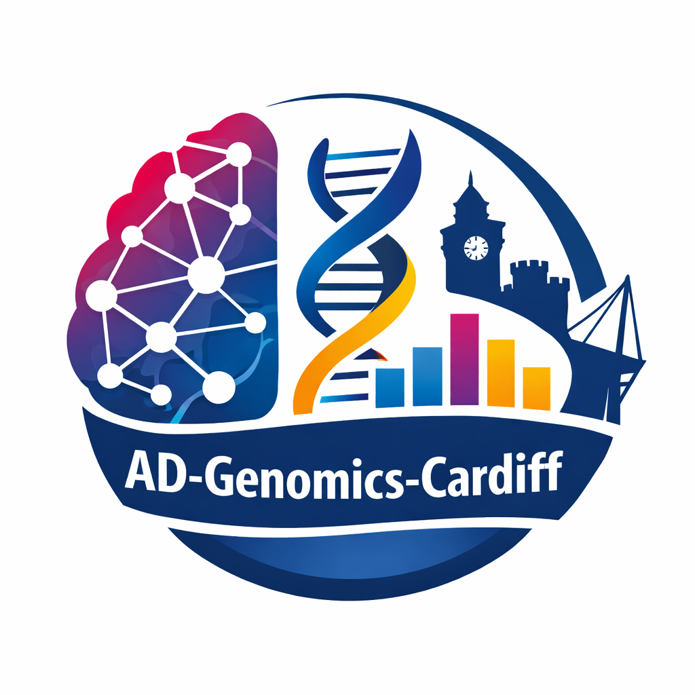

::: {.columns .home-hero}
::: {.column width="65%"}
# AD-Genomics-Cardiff

UK DRI Cardiff team hub for Alzheimer’s disease genomics

AD-Genomics-Cardiff is a UKDRI Cardiff team focused on integrative analysis of
genetic and multi-omics data for Alzheimer’s disease research. The site brings
together our research themes, projects, outputs, and team information in one
place, with room to add datasets, methods, and collaborative resources over time.

*UK Dementia Research Institute at Cardiff University*



:::

::: {.column width="35%"}
{.profile-pic fig-alt="Placeholder team image or research banner"}
:::
:::

---

## Research themes

::: {.grid}
::: {.g-col-12 .g-col-md-4}
### GWAS and polygenic risk
Understanding inherited susceptibility to Alzheimer’s disease through genome-wide
association studies and polygenic modelling.
:::

::: {.g-col-12 .g-col-md-4}
### Long-read sequencing and variant calling
Improving detection and interpretation of genetic variation using long-read data
and robust analytical workflows.
:::

::: {.g-col-12 .g-col-md-4}
### Pathway and functional analyses
Linking genomic signals to biological mechanisms through integrative downstream
analysis across molecular layers.
:::
:::

---

## Start here

::: {.grid}
::: {.g-col-12 .g-col-md-4}
::: {.card}
[**Projects →**](pages/projects.qmd)

Current workstreams, analysis areas, and placeholder summaries for ongoing team activity.
:::
:::

::: {.g-col-12 .g-col-md-4}
::: {.card}
[**People →**](pages/resume.qmd)

Team members, roles, affiliations, and collaboration points. Add biographies and links later.
:::
:::

::: {.g-col-12 .g-col-md-4}
::: {.card}
[**Outputs and resources →**](pages/outputs.qmd)

Publications, software, datasets, talks, and other shared outputs from the group.
:::
:::

::: {.g-col-12 .g-col-md-4}
::: {.card}
[**Resources →**](pages/cv.qmd)

Shared links, analysis resources, repository pointers, and contact placeholders for the team.
:::
:::
:::
